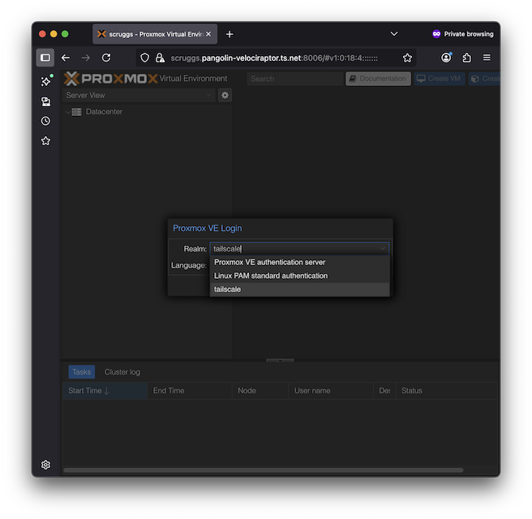
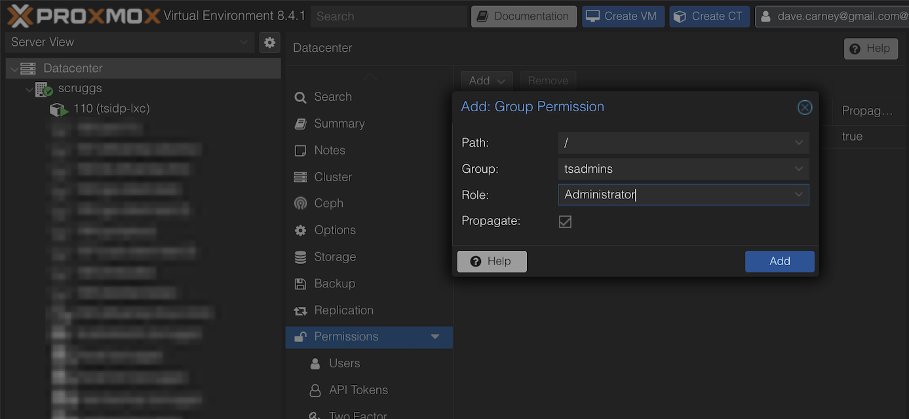

# `tsidp` - Tailscale OpenID Connect (OIDC) Identity Provider

> [!CAUTION]
> This is an experimental update of tsidp. It is under active development and may experince breaking changes.

[](https://tailscale.com/kb/1531/community-projects)

`tsidp` is an OIDC / OAuth Identity Provider (IdP) server that integrates with your Tailscale network. It allows you to use Tailscale identities for authentication into applications that support OpenID Connect as well as authenticated MCP client / server connections.

## Prerequisites

- A Tailscale network (tailnet) with magicDNS and HTTPS enabled
- A Tailscale authentication key from your tailnet
- (Recommended) Docker installed on your system

## Running tsidp

### (Recommended) Using the pre-built image

To be updated.

### Other ways to build & run tsidp

<details>
<summary>Building your own container</summary>

Replace `YOUR_TAILSCALE_AUTHKEY` with your Tailscale authentication key in the following commands:

1. Use an existing auth key or create a new auth key in the [Tailscale dashboard](https://login.tailscale.com/admin/settings/keys). Ensure you select an existing [tag](https://tailscale.com/kb/1068/tags) or create a new one.

```bash
# Build the container using the included Dockerfile
docker build -t tsidp .

# Run tsidp with a persistent volume to store state
docker run -d \
  --name tsidp \
  -p 443:443 \
  -e TS_AUTHKEY=YOUR_TAILSCALE_AUTHKEY \
  -e TSNET_FORCE_LOGIN=1 \
  -e TAILSCALE_USE_WIP_CODE=1 \
  -v tsidp-data:/var/lib/tsidp \
  tsidp --hostname=idp --dir=/var/lib/tsidp
```

Visit `https://idp.yourtailnet.ts.net` to confirm the service is running.

> [!NOTE]
> If you're running tsidp for the first time, you may not be able to access it initially even though it is running. It takes a few minutes for the TLS certificate to generate.

</details>

<details>
<summary>Using Go directly</summary>

If you'd like to build tsidp and / or run it directly you can do the following:

```bash
# Clone the Tailscale repository
git clone https://github.com/tailscale/tsidp.git
cd tsidp
```

Replace `YOUR_TAILSCALE_AUTHKEY` with your Tailscale authentication key in the following commands:

1. Use an existing auth key or create a new auth key in the [Tailscale dashboard](https://login.tailscale.com/admin/settings/keys). Ensure you select an existing [tag](https://tailscale.com/kb/1068/tags) or create a new one.
2. Run `TS_AUTH_KEY=YOUR_TAILSCALE_AUTHKEY TAILSCALE_USE_WIP_CODE=1 TSNET_FORCE_LOGIN=1 go run .`

Visit `https://idp.yourtailnet.ts.net` to confirm the service is running.

> [!NOTE]
> If you're running tsidp for the first time, you may not be able to access it initially even though it is running. It takes a few minutes for the TLS certificate to generate.

</details>

## Application Configuration Guides

tsidp can be used as IdP server for any application that supports custom OIDC providers.

> [!IMPORTANT]
> Note: If you'd like to use tsidp to login to a SaaS application outside of your tailnet rather than a self-hosted app inside of your tailnet, you'll need to run tsidp with `--funnel` enabled.

### Proxmox Setup with tsidp

This section covers:
- Deploying tsidp in a Docker container within a Linux Container (LXC)
- Configuring Proxmox to use tsidp for authentication

#### Deploy tsidp in Docker within an LXC

##### Prerequisites

Before starting, download an LXC template:
- See the [Proxmox Linux Container documentation](https://pve.proxmox.com/wiki/Linux_Container) for details
- For video guidance, see [this tutorial](https://www.youtube.com/watch?v=iIfRchzYSzM&t=300s) by [Christian Lempa](https://www.youtube.com/@christianlempa)
- This guide uses `alpine-3.21-default_20241217_amd64.tar.xz`, though other templates should work

##### Create the LXC

1. **Log in to Proxmox** and create a new LXC (we'll name it `tsidp-lxc`, but any name works)

   

2. **Configure the container** with these settings:
   - **General**
     - ✅ Enable "Unprivileged container"
     - ✅ Enable "Nesting" (required for Docker)
   - **Template**
     - Select `alpine-3.21-default_20241217_amd64.tar.xz`
   - **Disks**
     - Disk size: 4 GiB
   - **CPU**
     - Cores: 1
   - **Memory**
     - Memory: 512 MiB
     - Swap: 512 MiB
   - **Network**
     - Use default settings
   - **DNS**
     - Use default settings
   - **Confirm**
     - ✅ Enable "Start after created"
     - Click "Finish"

   > **Note**: We're not enabling `keyctl=1` as tsidp doesn't use Docker secrets.

##### Set Up Docker and tsidp

1. **Access the container console** in Proxmox
   - Log in as `root` with the password you specified

2. **Update packages and install dependencies**
   ```bash
   apk update
   apk add docker git
   ```

3. **Start and enable Docker**
   ```bash
   rc-service docker start
   rc-update add docker boot
   ```
   > You may see warnings, but should see `* Starting Docker Daemon ... [ ok ]`

4. **Verify Docker installation**
   ```bash
   docker --version
   ```

5. **Clone the tsidp repository**
   ```bash
   mkdir -p /usr/local/src && cd /usr/local/src
   git clone https://github.com/tailscale/tsidp.git
   ```

6. **Build and run tsidp**
   - Follow the "Building your own container" instructions, above

##### Configure Auto-start

Once `https://idp...` is working:

1. **Enable Docker container auto-restart**
   ```bash
   docker update --restart unless-stopped tsidp
   ```

2. **Enable LXC auto-start** in Proxmox UI:
   - Select the container
   - Go to Options → Set "Start at boot" to "Yes"

3. **Test the configuration** by rebooting the LXC and/or Proxmox server

#### Configure Proxmox to Use tsidp

This example assumes:
- Proxmox server: `https://scruggs.yourtailnet.ts.net:8006`
- tsidp instance: `https://idp.yourtailnet.ts.net`

##### Register Proxmox as a Client in tsidp

1. **Visit** `https://idp.yourtailnet.ts.net` and click "Add New Client"

   
   
2. **Configure the client**:
   - Add redirect URIs for each way you access Proxmox
   - Save the generated Client ID and Client Secret; you'll use these next

   

##### Configure OpenID Connect in Proxmox

1. **Navigate to** Datacenter → Permissions → Realms -> **Add an OpenID Connect Server**

   

2. **Configure the OpenID Connect Server realm** with these settings:
   - **Issuer URL**: `https://idp.yourtailnet.ts.net`
   - **Realm**: `tailscale` (or your preferred name)
   - **Client ID**: (from tsidp)
   - **Client Secret**: (from tsidp)
   - **Default**: Yes
   - **Autocreate Users**: Yes
   - **Username Claim**: `email`

   

##### Test the Authentication

1. **Open an incognito browser window** and navigate to `https://scruggs.yourtailnet.ts.net:8006`

2. **Log in** using the `tailscale` realm
   - Authentication should work immediately
   - Proxmox will auto-create a user account (due to "Autocreate Users: yes")
   - However, this user account will have no permissions.

   

3. **Close the incognito window**

##### Assign User Permissions

1. **Create an admin group**:
   - Go to Datacenter → Permissions → Groups
   - Create a group called `tsadmins`

2. **Grant administrator privileges**:
   - Go to Datacenter → Permissions
   - Add a Group Permission:
     - **Path**: `/`
     - **Group**: `tsadmins`
     - **Role**: `Administrator`

    

3. **Add users to the admin group**:
   - Go to Datacenter → Permissions → Users
   - Edit the auto-created user
   - Add them to the `tsadmins` group

#### Final Verification

Log out of Proxmox and log back in using the new Tailscale realm to verify everything is working correctly.

### TODOs
- (TODO) Grafana
- (TODO) open-webui
- (TODO) Jellyfin
- (TODO) Salesforce
- (TODO) ...

## MCP Configuration Guides

tsidp supports all of the endpoints required & suggested by the [MCP Authorization specification](https://modelcontextprotocol.io/specification/draft/basic/authorization), including Dynamic Client Registration (DCR). More information can be found in the following examples:

- (TODO) MCP Client / Server
- (TODO) MCP Client / Gateway Server

## tsidp Configuration Options

The `tsidp` server supports several command-line flags:

- `--verbose`: Enable verbose logging
- `--port`: Port to listen on (default: 443)
- `--local-port`: Allow requests from localhost
- `--use-local-tailscaled`: Use local tailscaled instead of tsnet
- `--funnel`: Use Tailscale Funnel to make tsidp available on the public internet so it works with SaaS products
- `--hostname`: tsnet hostname
- `--dir`: tsnet state directory
- `--enable-sts`: Enable OAuth token exchange using RFC 8693
- `--enable-debug`: Enable debug printing of requests to the server

### Environment Variables

- `TS_AUTHKEY`: Your Tailscale authentication key (required)
- `TS_HOSTNAME`: Hostname for the `tsidp` server (default: "idp", Docker only)
- `TS_STATE_DIR`: State directory (default: "/var/lib/tsidp", Docker only)
- `TAILSCALE_USE_WIP_CODE`: Enable work-in-progress code (default: "1")

## Support

This is an experimental, work in progress, [community project](https://tailscale.com/kb/1531/community-projects). For issues or questions, file issues on the [GitHub repository](https://github.com/tailscale/tsidp).

## License

BSD-3-Clause License. See [LICENSE](./LICENSE) for details.
