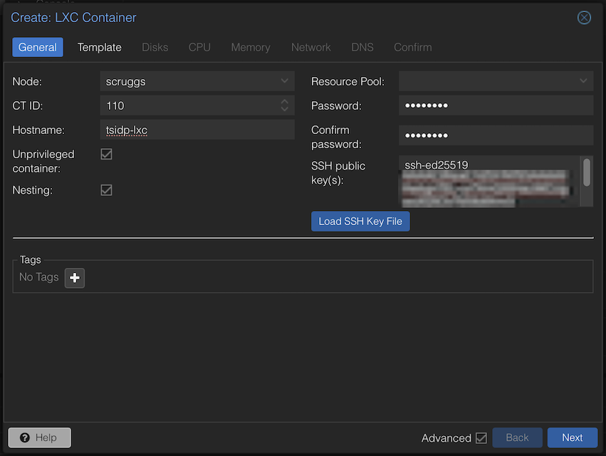
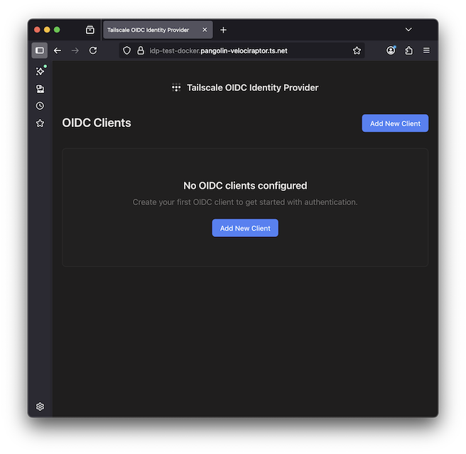
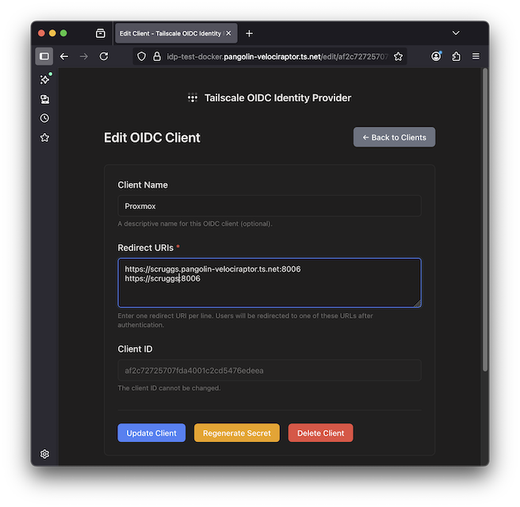
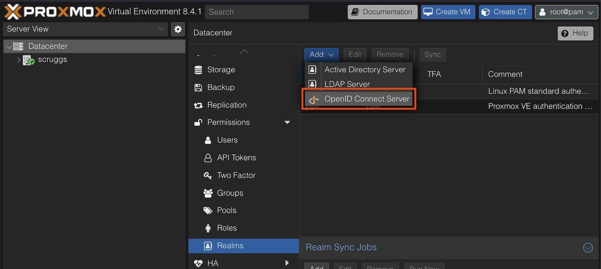
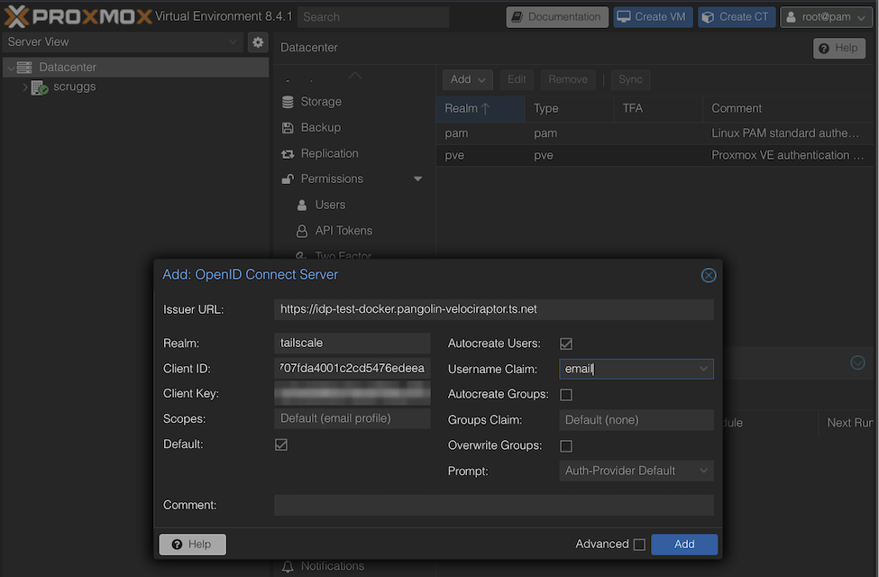
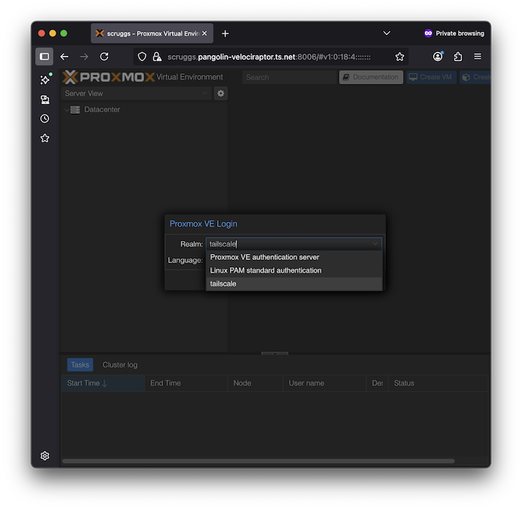
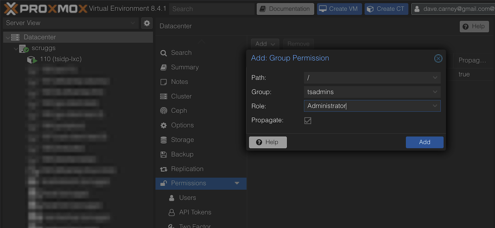

# Proxmox Setup with tsidp

This section covers:
- Deploying tsidp in a Docker container within a Linux Container (LXC)
- Configuring Proxmox to use tsidp for authentication

## Deploy tsidp in Docker within an LXC

### Prerequisites

Before starting, download an LXC template:
- See the [Proxmox Linux Container documentation](https://pve.proxmox.com/wiki/Linux_Container) for details
- For video guidance, see [this tutorial](https://www.youtube.com/watch?v=iIfRchzYSzM&t=300s) by [Christian Lempa](https://www.youtube.com/@christianlempa)
- This guide uses `alpine-3.21-default_20241217_amd64.tar.xz`, though other templates should work

### Create the LXC

1. **Log in to Proxmox** and create a new LXC (we'll name it `tsidp-lxc`, but any name works)

   

2. **Configure the container** with these settings:
   - **General**
     - ✅ Enable "Unprivileged container"
     - ✅ Enable "Nesting" (required for Docker)
   - **Template**
     - Select `alpine-3.21-default_20241217_amd64.tar.xz`
   - **Disks**
     - Disk size: 4 GiB
   - **CPU**
     - Cores: 1
   - **Memory**
     - Memory: 512 MiB
     - Swap: 512 MiB
   - **Network**
     - Use default settings
   - **DNS**
     - Use default settings
   - **Confirm**
     - ✅ Enable "Start after created"
     - Click "Finish"

   > **Note**: We're not enabling `keyctl=1` as tsidp doesn't use Docker secrets.

### Set Up Docker and tsidp

1. **Access the container console** in Proxmox
   - Log in as `root` with the password you specified

2. **Update packages and install dependencies**
   ```bash
   apk update
   apk add docker git
   ```

3. **Start and enable Docker**
   ```bash
   rc-service docker start
   rc-update add docker boot
   ```
   > You may see warnings, but should see `* Starting Docker Daemon ... [ ok ]`

4. **Verify Docker installation**
   ```bash
   docker --version
   ```

5. **Clone the tsidp repository**
   ```bash
   mkdir -p /usr/local/src && cd /usr/local/src
   git clone https://github.com/tailscale/tsidp.git
   ```

6. **Build and run tsidp**
   - Follow the [Building your own container](../../README.md) instructions to launch tsidp inside of a Docker container in the LXC

### Configure Auto-start

Once `https://idp...` is working:

1. **Enable Docker container auto-restart**
   ```bash
   docker update --restart unless-stopped tsidp
   ```

2. **Enable LXC auto-start** in Proxmox UI:
   - Select the container
   - Go to Options → Set "Start at boot" to "Yes"

3. **Test the configuration** by rebooting the LXC and/or Proxmox server

## Configure Proxmox to Use tsidp

This example assumes:
- Proxmox server: `https://scruggs.yourtailnet.ts.net:8006`
- tsidp instance: `https://idp.yourtailnet.ts.net`

### Register Proxmox as a Client in tsidp

1. **Visit** `https://idp.yourtailnet.ts.net` and click "Add New Client"

   
   
2. **Configure the client**:
   - Add redirect URIs for each way you access Proxmox
   - Save the generated Client ID and Client Secret; you'll use these next

   

### Configure OpenID Connect in Proxmox

1. **Navigate to** Datacenter → Permissions → Realms -> **Add an OpenID Connect Server**

   

2. **Configure the OpenID Connect Server realm** with these settings:
   - **Issuer URL**: `https://idp.yourtailnet.ts.net`
   - **Realm**: `tailscale` (or your preferred name)
   - **Client ID**: (from tsidp)
   - **Client Secret**: (from tsidp)
   - **Default**: Yes
   - **Autocreate Users**: Yes
   - **Username Claim**: `email`

   

### Test the Authentication

1. **Open an incognito browser window** and navigate to `https://scruggs.yourtailnet.ts.net:8006`

2. **Log in** using the `tailscale` realm
   - Authentication should work immediately
   - Proxmox will auto-create a user account (due to "Autocreate Users: yes")
   - However, this user account will have no permissions.

   

3. **Close the incognito window**

### Assign User Permissions

1. **Create an admin group**:
   - Go to Datacenter → Permissions → Groups
   - Create a group called `tsadmins`

2. **Grant administrator privileges**:
   - Go to Datacenter → Permissions
   - Add a Group Permission:
     - **Path**: `/`
     - **Group**: `tsadmins`
     - **Role**: `Administrator`

    

3. **Add users to the admin group**:
   - Go to Datacenter → Permissions → Users
   - Edit the auto-created user
   - Add them to the `tsadmins` group

## Final Verification

Log out of Proxmox and log back in using the new Tailscale realm to verify everything is working correctly.